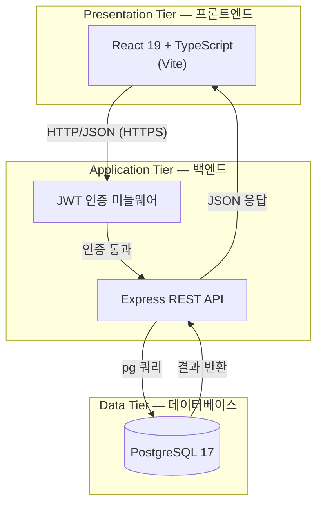
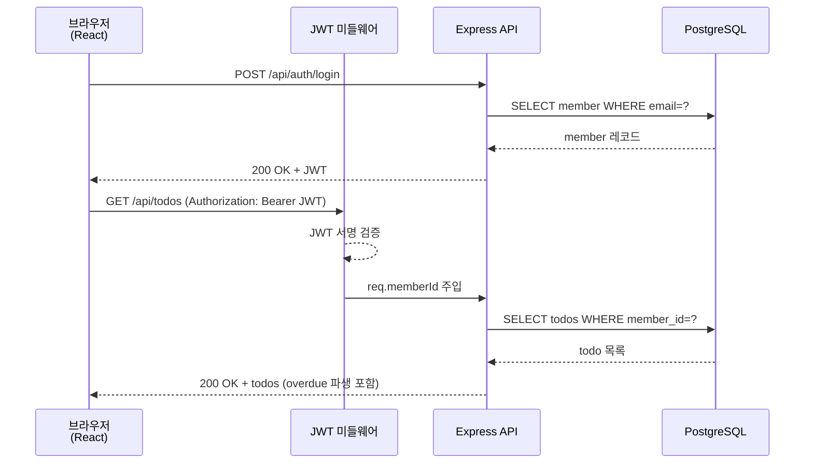
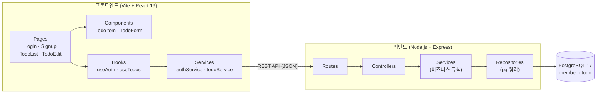
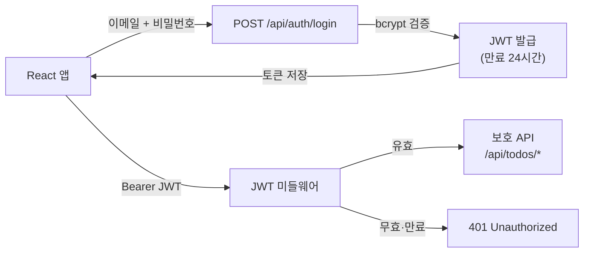

# 기술 아키텍처 다이어그램: my-todolist

## 문서 정보

| 항목 | 내용 |
|------|------|
| 버전 | v1.0 |
| 작성일 | 2026-02-11 |
| 근거 문서 | PRD v1.0, 프로젝트 구조 설계 원칙 v1.0 |

---

## 1. 3-Tier 아키텍처 개요

---

## 2. 주요 요청 흐름

---

## 3. 컴포넌트 구성

---

## 4. 인증 흐름

---

## 스택 요약

| 계층 | 기술 |
|------|------|
| 프론트엔드 | React 19, TypeScript, Vite |
| 백엔드 | Node.js, Express |
| 인증 | JWT (jsonwebtoken), bcrypt |
| 데이터베이스 | PostgreSQL 17 (pg 드라이버) |
| 배포 | Vercel |
