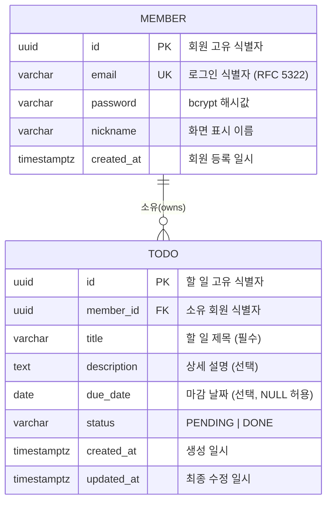

# ERD: my-todolist

## 문서 정보

| 항목 | 내용 |
|------|------|
| 버전 | v1.0 |
| 작성일 | 2026-02-11 |
| 근거 문서 | 도메인 정의서 v1.2, PRD v1.0 |

---

## ERD

---

## 테이블 정의

### MEMBER

| 컬럼 | 타입 | 제약 | 설명 |
|------|------|------|------|
| id | UUID | PK, NOT NULL, DEFAULT gen_random_uuid() | 회원 고유 식별자 |
| email | VARCHAR(255) | UNIQUE, NOT NULL | 로그인 식별자 (RFC 5322 형식) |
| password | VARCHAR(255) | NOT NULL | bcrypt 해시값 (cost factor 10 이상) |
| nickname | VARCHAR(50) | NOT NULL | 화면 표시 이름 |
| created_at | TIMESTAMPTZ | NOT NULL, DEFAULT now() | 회원 등록 일시 |

### TODO

| 컬럼 | 타입 | 제약 | 설명 |
|------|------|------|------|
| id | UUID | PK, NOT NULL, DEFAULT gen_random_uuid() | 할 일 고유 식별자 |
| member_id | UUID | FK → MEMBER(id), NOT NULL | 소유 회원 식별자 |
| title | VARCHAR(255) | NOT NULL | 할 일 제목 |
| description | TEXT | NULL 허용 | 상세 설명 |
| due_date | DATE | NULL 허용 | 마감 날짜 |
| status | VARCHAR(10) | NOT NULL, DEFAULT 'PENDING' | PENDING \| DONE |
| created_at | TIMESTAMPTZ | NOT NULL, DEFAULT now() | 생성 일시 |
| updated_at | TIMESTAMPTZ | NOT NULL, DEFAULT now() | 최종 수정 일시 |

---

## 설계 결정 사항

| 항목 | 결정 | 근거 |
|------|------|------|
| 식별자 타입 | UUID | 도메인 정의서 3.1, 3.2 |
| overdue 컬럼 | 미생성 | 조회 시 `due_date < CURRENT_DATE AND status = 'PENDING'` 으로 계산 (BR-T-07) |
| status 타입 | VARCHAR | 값은 'PENDING', 'DONE' 두 가지로 제한 (BR-T-04 ~ BR-T-06) |
| 삭제 방식 | 물리 삭제 (DELETE) | soft delete 컬럼 없음 (BR-T-08) |
| member_id FK | ON DELETE CASCADE | 회원 삭제 시 소유 할 일 일괄 제거 (Post-MVP F-P-01 대비) |
