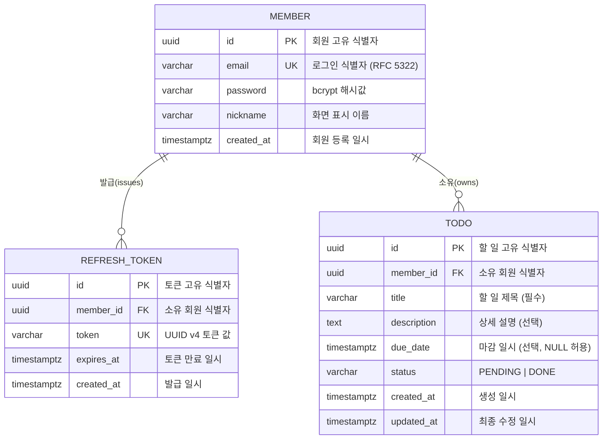

# ERD: my-todolist

## 문서 정보

| 항목 | 내용 |
|------|------|
| 버전 | v1.1 |
| 작성일 | 2026-02-11 |
| 최종 수정일 | 2026-02-12 |
| 근거 문서 | 도메인 정의서 v1.3, PRD v1.1 |

### 변경 이력

| 버전 | 날짜 | 변경 내용 |
|------|------|----------|
| v1.0 | 2026-02-11 | 최초 작성 (MEMBER, TODO 테이블) |
| v1.1 | 2026-02-12 | REFRESH_TOKEN 테이블 추가, due_date 타입 DATE → TIMESTAMPTZ, overdue 판정 기준 NOW() 반영, 인덱스 정보 보완 |

---

## ERD

---

## 테이블 정의

### MEMBER

| 컬럼 | 타입 | 제약 | 설명 |
|------|------|------|------|
| id | UUID | PK, NOT NULL, DEFAULT gen_random_uuid() | 회원 고유 식별자 |
| email | VARCHAR(255) | UNIQUE, NOT NULL | 로그인 식별자 (RFC 5322 형식) |
| password | VARCHAR(255) | NOT NULL | bcrypt 해시값 (cost factor 10 이상) |
| nickname | VARCHAR(50) | NOT NULL | 화면 표시 이름 |
| created_at | TIMESTAMPTZ | NOT NULL, DEFAULT now() | 회원 등록 일시 |

**인덱스**

| 인덱스명 | 컬럼 | 유형 |
|---------|------|------|
| member_pkey | id | UNIQUE (PK) |
| member_email_uk | email | UNIQUE |

### REFRESH_TOKEN

| 컬럼 | 타입 | 제약 | 설명 |
|------|------|------|------|
| id | UUID | PK, NOT NULL, DEFAULT gen_random_uuid() | 토큰 고유 식별자 |
| member_id | UUID | FK → MEMBER(id) ON DELETE CASCADE, NOT NULL | 소유 회원 식별자 |
| token | VARCHAR(36) | UNIQUE, NOT NULL | UUID v4 형식의 Refresh Token 값 |
| expires_at | TIMESTAMPTZ | NOT NULL | 토큰 만료 일시 (발급 후 7일) |
| created_at | TIMESTAMPTZ | NOT NULL, DEFAULT now() | 발급 일시 |

**인덱스**

| 인덱스명 | 컬럼 | 유형 |
|---------|------|------|
| refresh_token_pkey | id | UNIQUE (PK) |
| refresh_token_token_uk | token | UNIQUE |
| refresh_token_token_idx | token | BTREE |
| refresh_token_member_id_idx | member_id | BTREE |

### TODO

| 컬럼 | 타입 | 제약 | 설명 |
|------|------|------|------|
| id | UUID | PK, NOT NULL, DEFAULT gen_random_uuid() | 할 일 고유 식별자 |
| member_id | UUID | FK → MEMBER(id) ON DELETE CASCADE, NOT NULL | 소유 회원 식별자 |
| title | VARCHAR(255) | NOT NULL | 할 일 제목 |
| description | TEXT | NULL 허용 | 상세 설명 |
| due_date | TIMESTAMPTZ | NULL 허용 | 마감 일시 |
| status | VARCHAR(10) | NOT NULL, DEFAULT 'PENDING', CHECK IN ('PENDING','DONE') | PENDING \| DONE |
| created_at | TIMESTAMPTZ | NOT NULL, DEFAULT now() | 생성 일시 |
| updated_at | TIMESTAMPTZ | NOT NULL, DEFAULT now() | 최종 수정 일시 |

**인덱스**

| 인덱스명 | 컬럼 | 유형 |
|---------|------|------|
| todo_pkey | id | UNIQUE (PK) |
| todo_member_id_idx | member_id | BTREE |

---

## 설계 결정 사항

| 항목 | 결정 | 근거 |
|------|------|------|
| 식별자 타입 | UUID | 도메인 정의서 3.1, 3.2, 3.3 |
| overdue 컬럼 | 미생성 | 조회 시 `due_date < NOW() AND status = 'PENDING'` 으로 계산 (BR-T-07) |
| due_date 타입 | TIMESTAMPTZ | 시간대 포함 마감 일시 지원, overdue 판정을 현재 시각 기준으로 처리 |
| status 타입 | VARCHAR + CHECK | 값은 'PENDING', 'DONE' 두 가지로 제한 (BR-T-04 ~ BR-T-06) |
| 삭제 방식 | 물리 삭제 (DELETE) | soft delete 컬럼 없음 (BR-T-08) |
| member_id FK | ON DELETE CASCADE | 회원 삭제 시 소유 할 일 일괄 제거 (Post-MVP F-P-01 대비) |
| Refresh Token 저장 | REFRESH_TOKEN 테이블 | Token Rotation 지원, 만료 토큰 폐기 및 재발급 추적 (BR-M-05, BR-M-06) |
| refresh_token FK | ON DELETE CASCADE | 회원 탈퇴 시 발급된 토큰 일괄 제거 |
