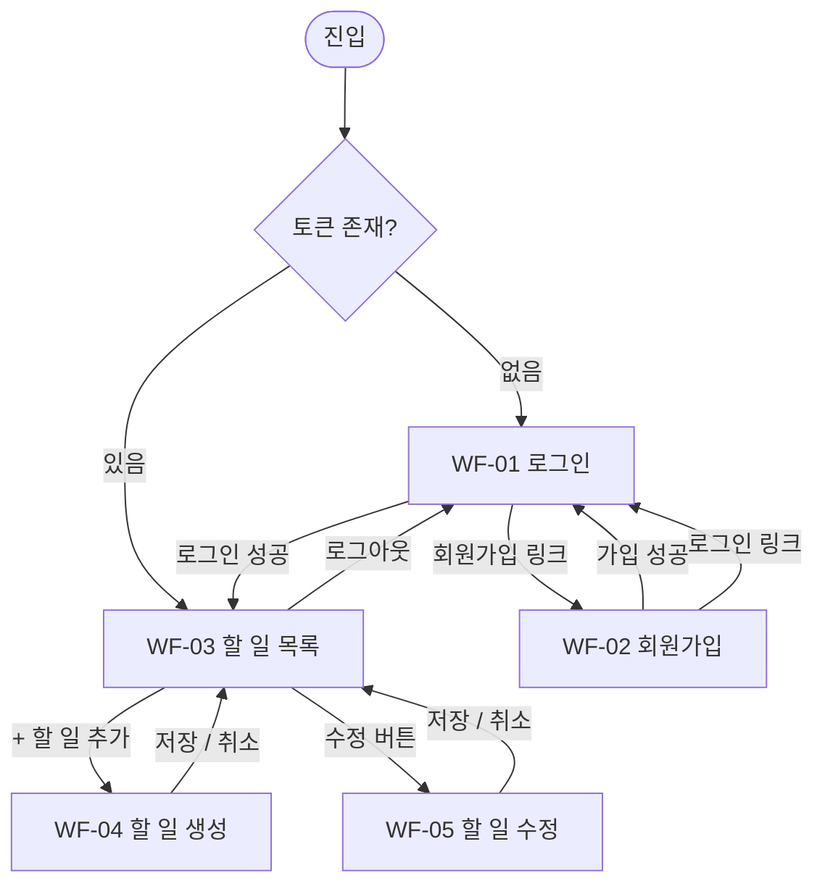

# 와이어프레임: my-todolist

## 문서 정보

| 항목 | 내용 |
|------|------|
| 버전 | v1.0 |
| 작성일 | 2026-02-11 |
| 근거 문서 | PRD v1.0 §6, 도메인 정의서 v1.2 §3, 사용자 시나리오 v1.0 |

---

## 화면 목록

| 화면 | 경로 | 인증 |
|------|------|------|
| WF-01 로그인 | `/login` | 불필요 |
| WF-02 회원가입 | `/signup` | 불필요 |
| WF-03 할 일 목록 | `/` | 필요 |
| WF-04 할 일 생성 | `/todos/new` | 필요 |
| WF-05 할 일 수정 | `/todos/:id/edit` | 필요 |

---

> 스타일 가이드 (색상 토큰, 타이포그래피, 컴포넌트 스펙): [APP_STYLE_GUIDE.md](./APP_STYLE_GUIDE.md)

---

## 화면 전환 흐름



---

## WF-01 로그인 (`/login`)

> 근거: PRD F-02, §6.1, §6.5 / SC-H-02, SC-E-03

```
┌─────────────────────────────────────────┐
│                                         │
│              my-todolist                │
│                                         │
│   ┌─────────────────────────────────┐   │
│   │             로그인              │   │
│   │                                 │   │
│   │  이메일                         │   │
│   │  ┌───────────────────────────┐  │   │
│   │  │ user@example.com          │  │   │
│   │  └───────────────────────────┘  │   │
│   │                                 │   │
│   │  비밀번호                       │   │
│   │  ┌───────────────────────────┐  │   │
│   │  │ ••••••••••                │  │   │
│   │  └───────────────────────────┘  │   │
│   │                                 │   │
│   │  ┌─ 오류 상태 ───────────────┐  │   │
│   │  │ ⚠ 이메일 또는 비밀번호가  │  │   │
│   │  │   올바르지 않습니다.      │  │   │
│   │  └───────────────────────────┘  │   │
│   │           (오류 시 표시)        │   │
│   │                                 │   │
│   │  ┌───────────────────────────┐  │   │
│   │  │          로그인           │  │   │  ← Primary 버튼
│   │  └───────────────────────────┘  │   │
│   │                                 │   │
│   │    계정이 없으신가요? [회원가입] │   │  ← /signup 링크
│   └─────────────────────────────────┘   │
│                                         │
└─────────────────────────────────────────┘
```

**인터랙션 명세**

| 상황 | 처리 |
|------|------|
| 성공 (SC-H-02) | `/` 로 이동 |
| 401 응답 (SC-E-03) | 인라인 오류 메시지 표시 |
| 인증된 사용자 접근 | `/` 로 리다이렉트 |

---

## WF-02 회원가입 (`/signup`)

> 근거: PRD F-01, §6.5 / SC-H-01, SC-E-01, SC-E-02

```
┌─────────────────────────────────────────┐
│                                         │
│              my-todolist                │
│                                         │
│   ┌─────────────────────────────────┐   │
│   │            회원가입             │   │
│   │                                 │   │
│   │  이메일                         │   │
│   │  ┌───────────────────────────┐  │   │
│   │  │ user@example.com          │  │   │
│   │  └───────────────────────────┘  │   │
│   │                                 │   │
│   │  비밀번호                       │   │
│   │  ┌───────────────────────────┐  │   │
│   │  │ ••••••••••                │  │   │
│   │  └───────────────────────────┘  │   │
│   │  힌트: 8자 이상, 영문+숫자 포함 │   │
│   │                                 │   │
│   │  닉네임                         │   │
│   │  ┌───────────────────────────┐  │   │
│   │  │ 홍길동                    │  │   │
│   │  └───────────────────────────┘  │   │
│   │                                 │   │
│   │  ┌─ 오류 상태 ───────────────┐  │   │
│   │  │ ⚠ 이미 사용 중인 이메일   │  │   │  ← 409
│   │  │   입니다. (또는 입력 오류) │  │   │  ← 400
│   │  └───────────────────────────┘  │   │
│   │           (오류 시 표시)        │   │
│   │                                 │   │
│   │  ┌───────────────────────────┐  │   │
│   │  │          가입하기         │  │   │  ← Primary 버튼
│   │  └───────────────────────────┘  │   │
│   │                                 │   │
│   │   이미 계정이 있으신가요? [로그인]│   │  ← /login 링크
│   └─────────────────────────────────┘   │
│                                         │
└─────────────────────────────────────────┘
```

**인터랙션 명세**

| 상황 | 처리 |
|------|------|
| 성공 (SC-H-01) | `/login` 으로 이동 |
| 409 중복 이메일 (SC-E-01) | 폼 하단 인라인 오류 |
| 400 정책 미충족 (SC-E-02) | 폼 하단 인라인 오류 |

---

## WF-03 할 일 목록 (`/`)

> 근거: PRD F-04, F-07, F-08, §6.3, §6.4 / SC-H-05, SC-H-06, SC-H-09, SC-H-10, SC-H-11

### 3-A 기본 상태

```
┌─────────────────────────────────────────────────────┐
│  내 할 일                    [+ 할 일 추가] [로그아웃] │  ← 헤더
├─────────────────────────────────────────────────────┤
│                                                     │
│  ┌───────────────────────────────────────────────┐  │
│  │ ╔═══════════════════════════════════════════╗ │  │
│  │ ║  [마감 초과]  Q1 보고서 제출              ║ │  │  ← Overdue 항목
│  │ ║               마감: 2026-02-08            ║ │  │    붉은 테두리(2px)
│  │ ╚═══════════════════════════════════════════╝ │  │
│  │              [완료] [수정] [삭제]             │  │
│  └───────────────────────────────────────────────┘  │
│                                                     │
│  ┌───────────────────────────────────────────────┐  │
│  │  팀 회의 준비                                 │  │  ← PENDING 기본
│  │  마감: 2026-02-15                             │  │
│  │              [완료] [수정] [삭제]             │  │
│  └───────────────────────────────────────────────┘  │
│                                                     │
│  ┌───────────────────────────────────────────────┐  │
│  │  ~~운영체제 과제 (1차 제출)~~                 │  │  ← DONE 항목
│  │  마감: 2026-02-10          (흐린 색상·취소선) │  │    취소선 + 흐림
│  │          [완료 취소] [수정] [삭제]            │  │
│  └───────────────────────────────────────────────┘  │
│                                                     │
└─────────────────────────────────────────────────────┘
```

### 3-B Overdue 아이템 상세

```
  ┌──────────────────────────────────────────────────┐
  │ ┌────────────────────────────────────────────┐   │
  │ │ ● [마감 초과]  제목 텍스트                 │   │  ← 붉은 배지(#D32F2F)
  │ │                설명 텍스트 (있을 경우)     │   │
  │ │                마감: YYYY-MM-DD            │   │
  │ └────────────────────────────────────────────┘   │
  │              [완료] [수정] [삭제]                 │
  └──────────────────────────────────────────────────┘
  ↑ 테두리: 2px solid #D32F2F
```

### 3-C 빈 목록 상태

```
┌─────────────────────────────────────────────────────┐
│  내 할 일                    [+ 할 일 추가] [로그아웃] │
├─────────────────────────────────────────────────────┤
│                                                     │
│                                                     │
│             할 일이 없습니다. 추가해보세요!          │
│                                                     │
│                                                     │
└─────────────────────────────────────────────────────┘
```

**아이템 상태 스타일 요약**

| 상태 | 테두리 | 배지 | 제목 | 배경 |
|------|--------|------|------|------|
| PENDING | 기본 (#e0e0e0) | 없음 | 기본 | 흰색 |
| PENDING + Overdue | 붉은색 2px (#D32F2F) | `마감 초과` (붉은 배지) | 기본 | 흰색 |
| DONE | 기본 | 없음 | ~~취소선~~ + 회색 | 연회색, 투명도 0.75 |

---

## WF-04 할 일 생성 (`/todos/new`)

> 근거: PRD F-03, §6.1 / SC-H-03, SC-H-04, SC-E-05

```
┌─────────────────────────────────────────┐
│                                         │
│           할 일 추가                    │
│                                         │
│  제목 *                                 │
│  ┌───────────────────────────────────┐  │
│  │ 제목을 입력하세요                 │  │
│  └───────────────────────────────────┘  │
│                                         │
│  설명 (선택)                            │
│  ┌───────────────────────────────────┐  │
│  │                                   │  │
│  │ (여러 줄 입력 가능)               │  │
│  │                                   │  │
│  └───────────────────────────────────┘  │
│                                         │
│  마감일 (선택)                          │
│  ┌───────────────────────────────────┐  │
│  │ YYYY-MM-DD        [날짜 선택 📅]  │  │
│  └───────────────────────────────────┘  │
│                                         │
│  ┌─ 오류 상태 ─────────────────────┐   │
│  │ ⚠ 제목을 입력해주세요.          │   │  ← 제목 누락 시 (SC-E-05)
│  └─────────────────────────────────┘   │
│                                         │
│              [취소]  [저장]             │  ← 취소: /, 저장: Primary
│                                         │
└─────────────────────────────────────────┘
```

**인터랙션 명세**

| 상황 | 처리 |
|------|------|
| 저장 성공 (SC-H-03, SC-H-04) | `/` 로 이동, 목록에 PENDING 항목 추가 |
| 제목 없이 저장 (SC-E-05) | 폼 오류 표시, API 호출 차단 |
| 취소 | `/` 로 이동 |

---

## WF-05 할 일 수정 (`/todos/:id/edit`)

> 근거: PRD F-05, §6.1 / SC-H-07, SC-E-06, SC-E-07

```
┌─────────────────────────────────────────┐
│                                         │
│           할 일 수정                    │
│                                         │
│  제목 *                                 │
│  ┌───────────────────────────────────┐  │
│  │ Q1 보고서 제출    ← 기존 값 로드  │  │
│  └───────────────────────────────────┘  │
│                                         │
│  설명 (선택)                            │
│  ┌───────────────────────────────────┐  │
│  │ 1분기 실적 포함   ← 기존 값 로드  │  │
│  │                                   │  │
│  └───────────────────────────────────┘  │
│                                         │
│  마감일 (선택)                          │
│  ┌───────────────────────────────────┐  │
│  │ 2026-02-08        ← 기존 값 로드  │  │
│  └───────────────────────────────────┘  │
│                                         │
│  ┌─ 오류 상태 ─────────────────────┐   │
│  │ ⚠ 접근 권한이 없습니다.         │   │  ← 403 (SC-E-07)
│  └─────────────────────────────────┘   │
│                                         │
│              [취소]  [저장]             │
│                                         │
└─────────────────────────────────────────┘
```

**인터랙션 명세**

| 상황 | 처리 |
|------|------|
| 저장 성공 (SC-H-07) | `/` 로 이동, 변경 내용 반영 |
| 403 타인 소유 (SC-E-07) | 인라인 오류 "접근 권한이 없습니다" |
| 401 미인증 (SC-E-06) | `/login` 리다이렉트 |
| 취소 | `/` 로 이동 |

